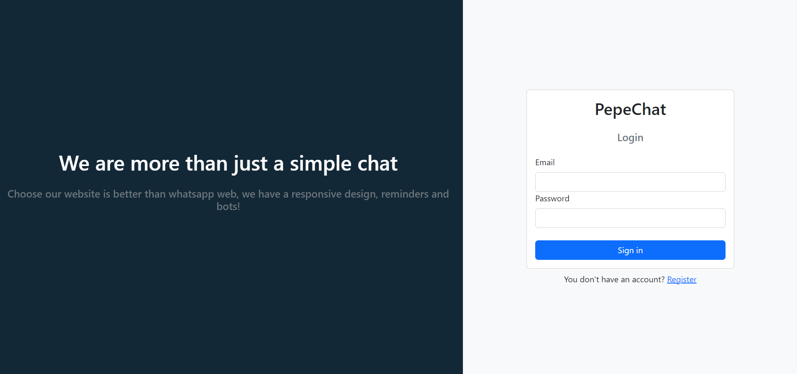
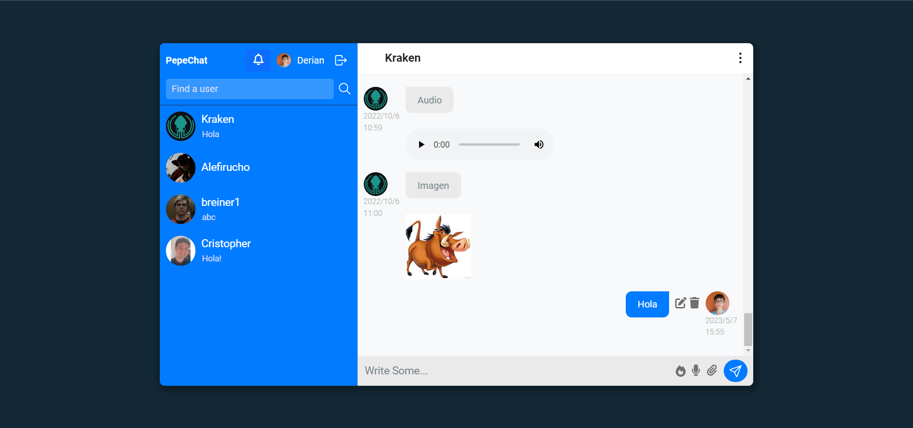

# PepeChat

Chat in real time, in which we can register to chat with other users, it is also possible to send images, audios, videos, set reminders, use bots, among other features.

## Overview

### Screenshot

### Links

- Solution URL: [Solution URL here](https://github.com/cris-gs/chat-app-so)
- Live Site URL: [Live site URL here](https://sopepechat.netlify.app/)

### Built with

- HTML5
- CSS3
- React - JS library
- Firebase